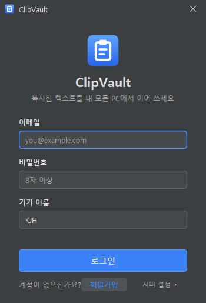
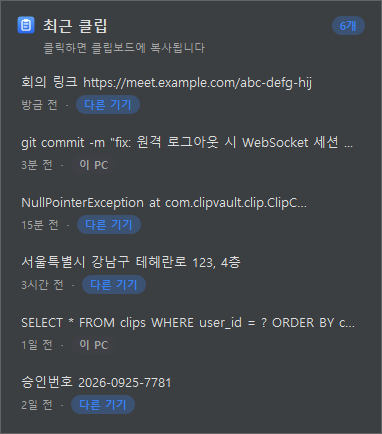
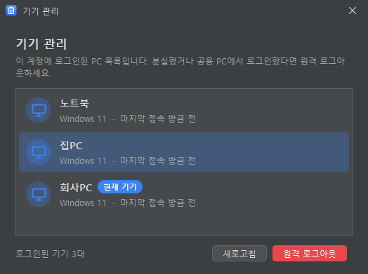
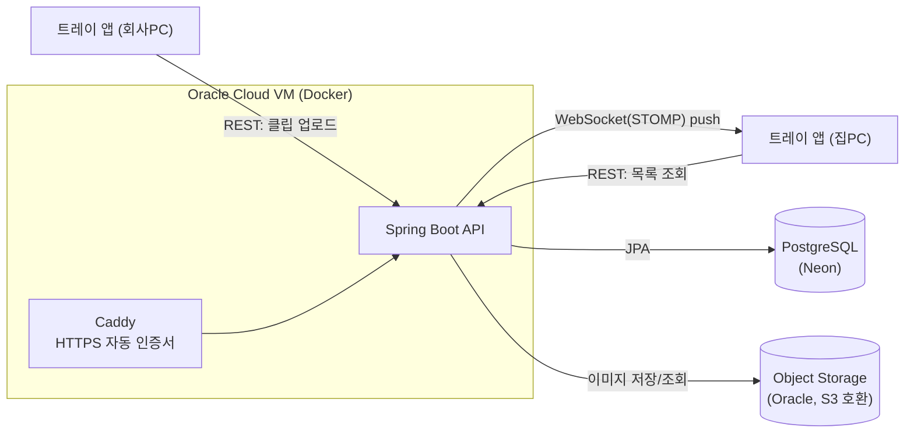

# ClipVault

**PC에서 복사(Ctrl+C)한 텍스트를 내 다른 PC로 자동 동기화하는 Windows 트레이 앱**

회사 PC에서 복사한 회의 링크를 집 PC에서 바로 붙여넣으세요. 메신저 '나와의 채팅'에 붙여넣고, 보내고, 다시 찾아 복사하는 과정이 필요 없습니다.

[](https://github.com/kbsjh8870/ClipVault/releases/latest/download/ClipVault-windows.zip)

<p align="center">
  
  
</p>
<p align="center">
  
</p>

---

## 다운로드 및 실행

1. **[ClipVault-windows.zip](https://github.com/kbsjh8870/ClipVault/releases/latest/download/ClipVault-windows.zip)** 을 받아 압축을 풉니다.
2. `ClipVault\ClipVault.exe` 를 실행합니다. Java 런타임이 포함되어 있어서 따로 설치할 필요가 없습니다.
3. 처음이면 **회원가입**을 하고, 다른 PC에서도 같은 계정으로 로그인하면 동기화가 시작됩니다.

> 서명되지 않은 실행 파일이라 처음 실행할 때 "Windows의 PC 보호" 경고가 뜰 수 있습니다. **추가 정보 → 실행**을 누르세요.
>
> 새 버전이 나오면 트레이 알림이 뜨고, 메뉴의 **업데이트**를 누르면 자동으로 받아 교체한 뒤 다시 켜집니다 (v1.1.0부터).
>
> 윈도우를 켤 때 자동으로 실행하려면 `Win+R` → `shell:startup` 폴더에 `ClipVault.exe` 바로가기를 넣으세요.

## 주요 기능

- **자동 캡처와 동기화**: 텍스트를 복사하면 서버에 올라가고, 다른 PC에 WebSocket으로 실시간 알림이 갑니다 (실측 1초 이내).
- **이미지 동기화**: 스크린샷 등 복사한 이미지도 동기화, 목록에서 썸네일로 확인 (10MB 이하)
- **알림 후 클릭 시 반영**: 다른 PC의 클립보드를 멋대로 덮어쓰지 않습니다. 트레이 목록에서 원하는 항목을 클릭할 때만 복사됩니다.
- **최근 클립 목록**: 트레이 아이콘을 클릭하면 최근 20개가 "3분 전 · 다른 기기"처럼 표시됩니다.
- **중복 방지**: 같은 텍스트를 다시 복사하면 새로 쌓지 않고 시각만 갱신합니다.
- **기기 관리 / 원격 로그아웃**: 분실한 노트북이나 공용 PC의 로그인을 다른 PC에서 즉시 끊을 수 있습니다. 열려 있던 연결도 바로 끊깁니다.
- **자동 만료**: 클립은 7일 뒤 자동으로 삭제되어 민감한 복사 내용이 무기한 쌓이지 않습니다.
- **일시정지**: 비밀번호처럼 민감한 내용을 복사할 때 동기화를 잠시 끌 수 있습니다.
- **네트워크 재연결**: 연결이 끊기면 1초에서 30초 사이 간격으로 자동 재연결하고, 끊겨 있던 동안 놓친 클립을 다시 조회합니다.
- **다크/라이트 테마**: 윈도우 앱 모드 설정을 따라갑니다.

## 아키텍처



1. 트레이 앱이 로컬 클립보드 변경을 감지하면 `POST /api/clips`로 업로드합니다.
2. 서버는 내용을 AES-GCM으로 암호화해 저장하고, `/topic/clips/{userId}`를 구독 중인 같은 사용자의 모든 기기에 알립니다.
3. 알림을 받은 기기는 트레이 알림만 띄웁니다. 자기가 올린 클립의 알림은 무시합니다.

## 기술 스택

| 영역 | 기술 |
|---|---|
| 백엔드 | Java 21, Spring Boot 4.1, Spring Security, Spring WebSocket (STOMP), Spring Data JPA |
| 인증 | JWT (JJWT), BCrypt, refresh token rotation |
| DB | PostgreSQL (Neon), 테스트는 H2 |
| 데스크톱 클라이언트 | Java 21 Swing/AWT SystemTray, FlatLaf, `java.net.http` (HTTP + WebSocket, STOMP는 직접 구현) |
| 배포 | Docker, Caddy (Let's Encrypt), Oracle Cloud Always Free (ARM), jpackage |

## 프로젝트 구조

```
clipvault/
├── backend/                 # Spring Boot API 서버
│   └── src/main/java/com/clipvault/
│       ├── auth/            # 회원가입/로그인/토큰 갱신, JWT
│       ├── device/          # 기기 등록/조회/원격 로그아웃
│       ├── clip/            # 클립 업로드/조회/삭제, 만료 배치
│       ├── websocket/       # STOMP 설정, CONNECT 인증, 세션 관리
│       ├── config/          # Security 설정
│       └── common/          # 예외 처리, SHA-256, AES-GCM
├── tray-client/             # Windows 트레이 앱
│   └── src/main/java/com/clipvault/client/
│       ├── clipboard/       # 클립보드 감시, 재업로드(에코) 방지
│       ├── network/         # REST 클라이언트, WebSocket + STOMP
│       ├── ui/              # 테마, 클립 목록, 기기 관리
│       └── auth/            # 로그인 창, 세션 저장
├── deploy/                  # 운영 서버용 docker compose + Caddy
├── docker-compose.yml       # 로컬 개발용 (PostgreSQL + backend)
└── docs/                    # PRD, TRD, TASKS, API 계약서
```

## 로컬에서 실행하기

필요한 것: JDK 21, Docker

```bash
# 1) PostgreSQL + 백엔드 실행 (http://localhost:8080)
docker compose up -d --build

# 2) 트레이 앱 실행 → 로그인 창의 "서버 설정"에 http://localhost:8080 입력
./gradlew :tray-client:run

# 테스트 (백엔드 통합 테스트 + 트레이 앱 단위 테스트)
./gradlew test

# Windows 실행 파일 만들기 → tray-client/build/dist/ClipVault-windows.zip
./gradlew :tray-client:packageZip
```

트레이 앱의 서버 주소는 `-Dclipvault.server=...` 옵션, `CLIPVAULT_SERVER` 환경변수, 로그인 창의 "서버 설정" 순서로 지정할 수 있습니다.

## 배포

Oracle Cloud VM 같은 Linux 서버에서 실행합니다. 서버 VM의 방화벽에서 80/443 포트를 열어 두어야 합니다.

```bash
git clone https://github.com/kbsjh8870/ClipVault.git && cd ClipVault
cp deploy/.env.example deploy/.env   # DOMAIN, DB 접속 정보, 비밀키 입력
sudo docker compose -f deploy/docker-compose.prod.yml up -d --build
```

| 환경변수 | 설명 |
|---|---|
| `DOMAIN` | 서버 주소. 도메인이 없으면 `1-2-3-4.sslip.io`처럼 공인 IP 기반 주소를 씁니다 |
| `DB_URL`, `DB_USERNAME`, `DB_PASSWORD` | PostgreSQL 접속 정보 (JDBC 형식) |
| `JWT_SECRET` | 토큰 서명 키, 32바이트 이상 (`openssl rand -base64 48`) |
| `CLIP_ENCRYPTION_KEY` | 클립 암호화 키, base64 32바이트 (`openssl rand -base64 32`). 잃어버리면 저장된 클립을 복호화할 수 없습니다 |
| `S3_ENDPOINT`, `S3_REGION`, `S3_BUCKET`, `S3_ACCESS_KEY`, `S3_SECRET_KEY` | 이미지 저장용 Oracle Object Storage(S3 호환) 접속 정보. `S3_BUCKET`이 비어 있으면 로컬 폴더(`IMAGE_LOCAL_DIR`, 기본 `./data/images`)에 저장합니다 |

Caddy가 HTTPS 인증서를 자동으로 발급하고 갱신하며, WebSocket(`wss://`)도 그대로 전달합니다.

## API 요약

| Method | Path | 설명 |
|---|---|---|
| POST | `/api/auth/signup` | 회원가입 |
| POST | `/api/auth/login` | 로그인 → 기기 등록용 user 토큰 |
| POST | `/api/auth/refresh` | 토큰 갱신 (refresh 토큰은 쓸 때마다 교체) |
| POST | `/api/devices` | 기기 등록 → device 토큰 쌍 |
| GET | `/api/devices` | 내 기기 목록 |
| DELETE | `/api/devices/{id}` | 원격 로그아웃 |
| POST | `/api/clips` | 클립 업로드 (같은 내용이면 200 + 시각 갱신) |
| GET | `/api/clips?limit=20` | 최근 클립 |
| DELETE | `/api/clips/{id}` | 클립 삭제 |
| WS | `/ws` (STOMP) | `/topic/clips/{userId}` 구독 |

전체 명세는 [docs/API_CONTRACT.md](docs/API_CONTRACT.md)에 있습니다.

## 설계 결정과 트레이드오프

- **자동 반영 대신 알림 후 클릭 시 반영**: 붙여넣으려는 순간 클립보드가 바뀌어 있으면 사용자가 당황합니다. 그래서 편리함보다 예측 가능성을 택했습니다.
- **모바일 제외**: Android 10 이상과 iOS는 백그라운드 클립보드 접근을 막습니다. 결국 모바일에서는 수동으로 저장해야 하는데, 그러면 메신저 우회 방식과 차별점이 없습니다.
- **서버 측 암호화 (E2E 아님)**: 종단간 암호화는 키 관리가 복잡해서 v1에서는 AES-GCM 저장 암호화와 HTTPS로 시작했습니다. 중복 판별은 암호문 대신 원문의 SHA-256 해시로 합니다.
- **user 토큰과 device 토큰 분리**: 로그인 토큰으로는 기기 등록만 가능하고, 모든 요청은 기기별 토큰으로 합니다. 요청마다 기기 활성 상태를 확인하므로 원격 로그아웃이 즉시 반영됩니다.
- **에코 방지**: 서버에서 받아 로컬에 반영한 텍스트는 5초 동안 다시 업로드하지 않습니다. 기기 간 무한 핑퐁을 막기 위해서입니다.

자세한 내용은 [PRD](docs/PRD.md), [TRD](docs/TRD.md), [TASKS](docs/TASKS.md)를 참고하세요.

## 로드맵

- 모바일 대응 (PWA, 수동 저장/복사)
- macOS 트레이 앱
- 검색 / 태그 / 즐겨찾기
- 종단간 암호화
- GitHub Actions로 빌드/릴리스 자동화
